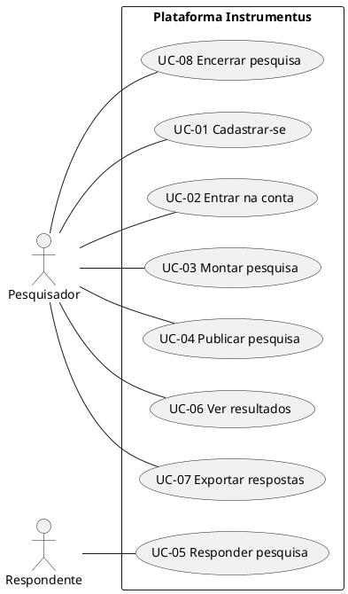

# Diagrama de casos de uso

Em PlantUML (sintaxe conferida no Context7). Não há `include` nem `extend`: a spec não decide nenhum.

```plantuml
@startuml
left to right direction
actor Pesquisador
actor Respondente
rectangle "Plataforma Instrumentus" {
  usecase "UC-01 Cadastrar-se" as UC01
  usecase "UC-02 Entrar na conta" as UC02
  usecase "UC-03 Montar pesquisa" as UC03
  usecase "UC-04 Publicar pesquisa" as UC04
  usecase "UC-05 Responder pesquisa" as UC05
  usecase "UC-06 Ver resultados" as UC06
  usecase "UC-07 Exportar respostas" as UC07
  usecase "UC-08 Encerrar pesquisa" as UC08
}
Pesquisador -- UC01
Pesquisador -- UC02
Pesquisador -- UC03
Pesquisador -- UC04
Respondente -- UC05
Pesquisador -- UC06
Pesquisador -- UC07
Pesquisador -- UC08
@enduml
```
